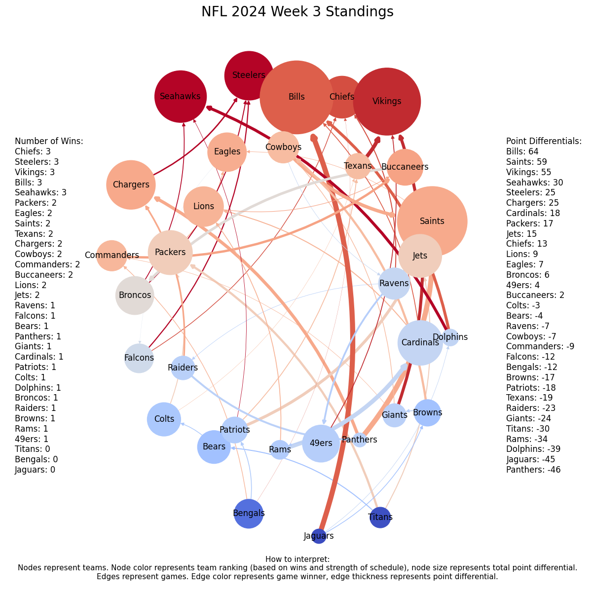

# nfl_standings
A graph of NFL standings, depicting game results and point differentials.

The aim is to enable a quick grasp of power dynamics within the league. Arrow thickness and circle size represent point differentials, so dominant performances stand out, effectively illustrating the transfer of momentum from one team to another.

Upsets are easily spotted as arrows from a red(der) circle to a blue(r) one.

